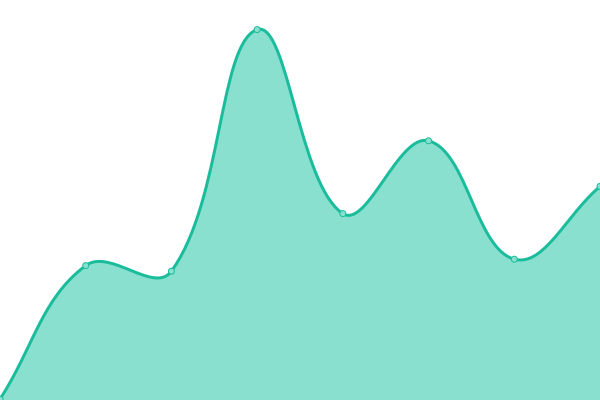

# [📈 Live Status](https://LeastAuthority.github.io/org-members-upptime): <!--live status--> **🟩 All systems operational**

This repository contains the open-source uptime monitor and status page for [Least Authority](https://leastauthority.com/), powered by [Upptime](https://github.com/upptime/upptime).

With [Upptime](https://upptime.js.org), you can get your own unlimited and free uptime monitor and status page, powered entirely by a GitHub repository. We use [Issues](https://github.com/LeastAuthority/org-members-upptime/issues) as incident reports, [Actions](https://github.com/LeastAuthority/org-members-upptime/actions) as uptime monitors, and [Pages](https://LeastAuthority.github.io/org-members-upptime) for the status page.

<!--start: status pages-->
<!-- This summary is generated by Upptime (https://github.com/upptime/upptime) -->
<!-- Do not edit this manually, your changes will be overwritten -->
<!-- prettier-ignore -->
| URL | Status | History | Response Time | Uptime |
| --- | ------ | ------- | ------------- | ------ |
|  [1Password](https://my.1password.com/signin) | 🟩 Up | [1-password.yml](https://github.com/LeastAuthority/org-members-upptime/commits/HEAD/history/1-password.yml) | 

 264ms
     
 | 

<a href="https://LeastAuthority.github.io/org-members-upptime/history/1-password">100.00%</a>
    

|  [CDR Link - PS and HRO](https://leastauthority.cdr.link/) | 🟩 Up | [cdr-link-ps-and-hro.yml](https://github.com/LeastAuthority/org-members-upptime/commits/HEAD/history/cdr-link-ps-and-hro.yml) | 

 429ms
     
 | 

<a href="https://LeastAuthority.github.io/org-members-upptime/history/cdr-link-ps-and-hro">100.00%</a>
    

|  [Docs](https://docs.latfa.net/) | 🟩 Up | [docs.yml](https://github.com/LeastAuthority/org-members-upptime/commits/HEAD/history/docs.yml) | 

 985ms
     
 | 

<a href="https://LeastAuthority.github.io/org-members-upptime/history/docs">100.00%</a>
    

|  [Deel](https://app.deel.com/) | 🟩 Up | [deel.yml](https://github.com/LeastAuthority/org-members-upptime/commits/HEAD/history/deel.yml) | 

 227ms
     
 | 

<a href="https://LeastAuthority.github.io/org-members-upptime/history/deel">100.00%</a>
    

|  [GitHub - LA](https://github.com/LeastAuthority/) | 🟩 Up | [git-hub-la.yml](https://github.com/LeastAuthority/org-members-upptime/commits/HEAD/history/git-hub-la.yml) | 

 666ms
     
 | 

<a href="https://LeastAuthority.github.io/org-members-upptime/history/git-hub-la">100.00%</a>
    

|  [GitHub - PS](https://github.com/PrivateStorageio/) | 🟩 Up | [git-hub-ps.yml](https://github.com/LeastAuthority/org-members-upptime/commits/HEAD/history/git-hub-ps.yml) | 

 449ms
     
 | 

<a href="https://LeastAuthority.github.io/org-members-upptime/history/git-hub-ps">100.00%</a>
    

|  [GitLab - PS](https://whetstone.private.storage/) | 🟩 Up | [git-lab-ps.yml](https://github.com/LeastAuthority/org-members-upptime/commits/HEAD/history/git-lab-ps.yml) | 

 842ms
     
 | 

<a href="https://LeastAuthority.github.io/org-members-upptime/history/git-lab-ps">100.00%</a>
    

|  [Google Workspace](https://workspace.google.com/dashboard) | 🟩 Up | [google-workspace.yml](https://github.com/LeastAuthority/org-members-upptime/commits/HEAD/history/google-workspace.yml) | 

 540ms
     
 | 

<a href="https://LeastAuthority.github.io/org-members-upptime/history/google-workspace">100.00%</a>
    

|  LimeSurvey - LA | 🟩 Up | [lime-survey-la.yml](https://github.com/LeastAuthority/org-members-upptime/commits/HEAD/history/lime-survey-la.yml) | 

 854ms
     
 | 

<a href="https://LeastAuthority.github.io/org-members-upptime/history/lime-survey-la">100.00%</a>
    

|  [Overleaf - LA](https://www.overleaf.com/project/6058b9d527814c9a91678a8a) | 🟩 Up | [overleaf-la.yml](https://github.com/LeastAuthority/org-members-upptime/commits/HEAD/history/overleaf-la.yml) | 

 139ms
     
 | 

<a href="https://LeastAuthority.github.io/org-members-upptime/history/overleaf-la">100.00%</a>
    

|  [Matomo - PS](https://matomo.private.storage/) | 🟩 Up | [matomo-ps.yml](https://github.com/LeastAuthority/org-members-upptime/commits/HEAD/history/matomo-ps.yml) | 

 2503ms
     
 | 

<a href="https://LeastAuthority.github.io/org-members-upptime/history/matomo-ps">100.00%</a>
    

|  [Roundcube webmail - LA](https://mail.latfa.net/) | 🟩 Up | [roundcube-webmail-la.yml](https://github.com/LeastAuthority/org-members-upptime/commits/HEAD/history/roundcube-webmail-la.yml) | 

 611ms
     
 | 

<a href="https://LeastAuthority.github.io/org-members-upptime/history/roundcube-webmail-la">100.00%</a>
    

|  [Slack - LA](https://leastauthority.slack.com/) | 🟩 Up | [slack-la.yml](https://github.com/LeastAuthority/org-members-upptime/commits/HEAD/history/slack-la.yml) | 

 307ms
     
 | 

<a href="https://LeastAuthority.github.io/org-members-upptime/history/slack-la">100.00%</a>
    

|  SnipeIT - LA | 🟩 Up | [snipe-it-la.yml](https://github.com/LeastAuthority/org-members-upptime/commits/HEAD/history/snipe-it-la.yml) | 

 1450ms
     
 | 

<a href="https://LeastAuthority.github.io/org-members-upptime/history/snipe-it-la">100.00%</a>
    

|  SuiteCRM - LA | 🟩 Up | [suite-crm-la.yml](https://github.com/LeastAuthority/org-members-upptime/commits/HEAD/history/suite-crm-la.yml) | 

 945ms
     
 | 

<a href="https://LeastAuthority.github.io/org-members-upptime/history/suite-crm-la">100.00%</a>
    

|  [WP Engine](https://my.wpengine.com/) | 🟩 Up | [wp-engine.yml](https://github.com/LeastAuthority/org-members-upptime/commits/HEAD/history/wp-engine.yml) | 

 190ms
     
 | 

<a href="https://LeastAuthority.github.io/org-members-upptime/history/wp-engine">100.00%</a>
    

|  [WordPress - LA](https://leastauthority.com/wp-login.php) | 🟩 Up | [word-press-la.yml](https://github.com/LeastAuthority/org-members-upptime/commits/HEAD/history/word-press-la.yml) | 

 635ms
     
 | 

<a href="https://LeastAuthority.github.io/org-members-upptime/history/word-press-la">100.00%</a>
    

|  Zulip - PS | 🟩 Up | [zulip-ps.yml](https://github.com/LeastAuthority/org-members-upptime/commits/HEAD/history/zulip-ps.yml) | 

 671ms
     
 | 

<a href="https://LeastAuthority.github.io/org-members-upptime/history/zulip-ps">100.00%</a>
    

<!--end: status pages-->

[**Visit our status website →**](https://LeastAuthority.github.io/org-members-upptime)

## 📄 License

- Powered by: [Upptime](https://github.com/upptime/upptime)
- Code: [MIT](./LICENSE) © [Least Authority](https://leastauthority.com/)
- Data in the `./history` directory: [Open Database License](https://opendatacommons.org/licenses/odbl/1-0/)
