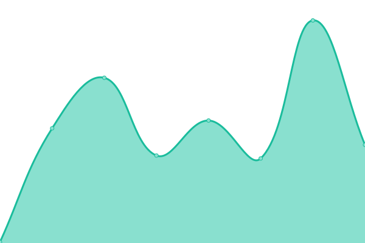

# [📈 Live Status](https://LeastAuthority.github.io/org-members-upptime): <!--live status--> **🟧 Partial outage**

This repository contains the open-source uptime monitor and status page for [Least Authority](https://leastauthority.com/), powered by [Upptime](https://github.com/upptime/upptime).

With [Upptime](https://upptime.js.org), you can get your own unlimited and free uptime monitor and status page, powered entirely by a GitHub repository. We use [Issues](https://github.com/LeastAuthority/org-members-upptime/issues) as incident reports, [Actions](https://github.com/LeastAuthority/org-members-upptime/actions) as uptime monitors, and [Pages](https://LeastAuthority.github.io/org-members-upptime) for the status page.

<!--start: status pages-->
<!-- This summary is generated by Upptime (https://github.com/upptime/upptime) -->
<!-- Do not edit this manually, your changes will be overwritten -->
<!-- prettier-ignore -->
| URL | Status | History | Response Time | Uptime |
| --- | ------ | ------- | ------------- | ------ |
|  [1Password](https://my.1password.com/signin) | 🟩 Up | [1-password.yml](https://github.com/LeastAuthority/org-members-upptime/commits/HEAD/history/1-password.yml) | 

 200ms
     
 | 

<a href="https://LeastAuthority.github.io/org-members-upptime/history/1-password">100.00%</a>
    

|  [GitHub - LA](https://github.com/LeastAuthority/) | 🟩 Up | [git-hub-la.yml](https://github.com/LeastAuthority/org-members-upptime/commits/HEAD/history/git-hub-la.yml) | 

 396ms
     
 | 

<a href="https://LeastAuthority.github.io/org-members-upptime/history/git-hub-la">100.00%</a>
    

|  [GitHub - PS](https://github.com/PrivateStorageio/) | 🟩 Up | [git-hub-ps.yml](https://github.com/LeastAuthority/org-members-upptime/commits/HEAD/history/git-hub-ps.yml) | 

 300ms
     
 | 

<a href="https://LeastAuthority.github.io/org-members-upptime/history/git-hub-ps">0.00%</a>
    

|  [GitLab - PS](https://whetstone.private.storage/) | 🟩 Up | [git-lab-ps.yml](https://github.com/LeastAuthority/org-members-upptime/commits/HEAD/history/git-lab-ps.yml) | 

 758ms
     
 | 

<a href="https://LeastAuthority.github.io/org-members-upptime/history/git-lab-ps">100.00%</a>
    

|  [Google Workspace](https://workspace.google.com/dashboard) | 🟩 Up | [google-workspace.yml](https://github.com/LeastAuthority/org-members-upptime/commits/HEAD/history/google-workspace.yml) | 

 444ms
     
 | 

<a href="https://LeastAuthority.github.io/org-members-upptime/history/google-workspace">100.00%</a>
    

|  LimeSurvey - LA | 🟩 Up | [lime-survey-la.yml](https://github.com/LeastAuthority/org-members-upptime/commits/HEAD/history/lime-survey-la.yml) | 

 754ms
     
 | 

<a href="https://LeastAuthority.github.io/org-members-upptime/history/lime-survey-la">100.00%</a>
    

|  [Open Project - LA](https://leastauthority.openproject.com/) | 🟥 Down | [open-project-la.yml](https://github.com/LeastAuthority/org-members-upptime/commits/HEAD/history/open-project-la.yml) | 

 548ms
     
 | 

<a href="https://LeastAuthority.github.io/org-members-upptime/history/open-project-la">0.00%</a>
    

|  [Overleaf - LA](https://www.overleaf.com/project/6058b9d527814c9a91678a8a) | 🟩 Up | [overleaf-la.yml](https://github.com/LeastAuthority/org-members-upptime/commits/HEAD/history/overleaf-la.yml) | 

 95ms
     
 | 

<a href="https://LeastAuthority.github.io/org-members-upptime/history/overleaf-la">100.00%</a>
    

|  Matomo - PS | 🟥 Down | [matomo-ps.yml](https://github.com/LeastAuthority/org-members-upptime/commits/HEAD/history/matomo-ps.yml) | 

 1681ms
     
 | 

<a href="https://LeastAuthority.github.io/org-members-upptime/history/matomo-ps">84.92%</a>
    

|  [Remote](https://remote.com/) | 🟩 Up | [remote.yml](https://github.com/LeastAuthority/org-members-upptime/commits/HEAD/history/remote.yml) | 

 136ms
     
 | 

<a href="https://LeastAuthority.github.io/org-members-upptime/history/remote">100.00%</a>
    

|  [Slack - LA](https://leastauthority.slack.com/) | 🟩 Up | [slack-la.yml](https://github.com/LeastAuthority/org-members-upptime/commits/HEAD/history/slack-la.yml) | 

 202ms
     
 | 

<a href="https://LeastAuthority.github.io/org-members-upptime/history/slack-la">100.00%</a>
    

|  SuiteCRM - LA | 🟩 Up | [suite-crm-la.yml](https://github.com/LeastAuthority/org-members-upptime/commits/HEAD/history/suite-crm-la.yml) | 

 830ms
     
 | 

<a href="https://LeastAuthority.github.io/org-members-upptime/history/suite-crm-la">100.00%</a>
    

|  [Whereby - LA](https://la.whereby.com/) | 🟩 Up | [whereby-la.yml](https://github.com/LeastAuthority/org-members-upptime/commits/HEAD/history/whereby-la.yml) | 

 599ms
     
 | 

<a href="https://LeastAuthority.github.io/org-members-upptime/history/whereby-la">100.00%</a>
    

|  [WP Engine](https://my.wpengine.com/) | 🟩 Up | [wp-engine.yml](https://github.com/LeastAuthority/org-members-upptime/commits/HEAD/history/wp-engine.yml) | 

 161ms
     
 | 

<a href="https://LeastAuthority.github.io/org-members-upptime/history/wp-engine">100.00%</a>
    

|  [WordPress - LA](https://leastauthority.com/wp-login.php) | 🟩 Up | [word-press-la.yml](https://github.com/LeastAuthority/org-members-upptime/commits/HEAD/history/word-press-la.yml) | 

 507ms
     
 | 

<a href="https://LeastAuthority.github.io/org-members-upptime/history/word-press-la">100.00%</a>
    

|  Zulip - PS | 🟩 Up | [zulip-ps.yml](https://github.com/LeastAuthority/org-members-upptime/commits/HEAD/history/zulip-ps.yml) | 

 787ms
     
 | 

<a href="https://LeastAuthority.github.io/org-members-upptime/history/zulip-ps">100.00%</a>
    

<!--end: status pages-->

[**Visit our status website →**](https://LeastAuthority.github.io/org-members-upptime)

## 📄 License

- Powered by: [Upptime](https://github.com/upptime/upptime)
- Code: [MIT](./LICENSE) © [Least Authority](https://leastauthority.com/)
- Data in the `./history` directory: [Open Database License](https://opendatacommons.org/licenses/odbl/1-0/)
